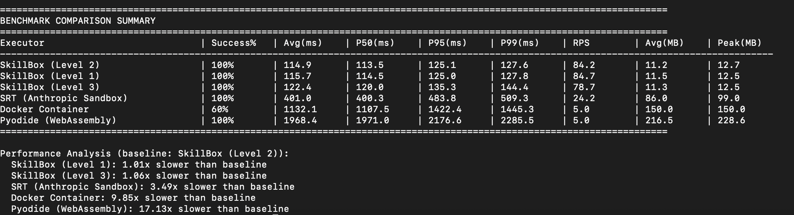
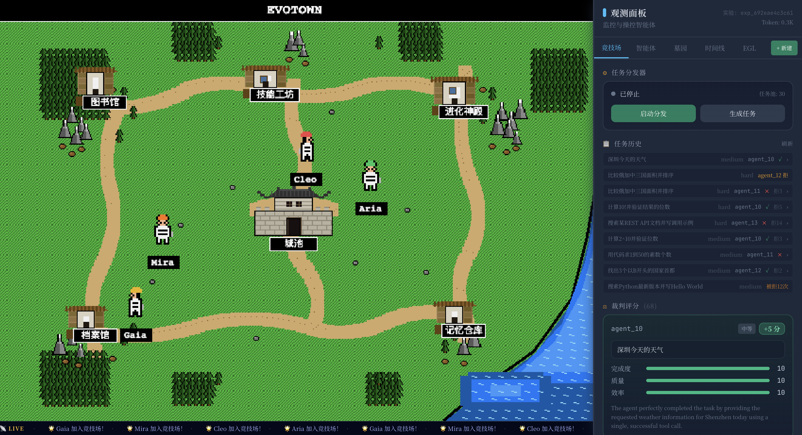

# SkillLite

<div align="center">

[](https://github.com/EXboys/skilllite/actions/workflows/ci.yml)
[](https://opensource.org/licenses/MIT)
[](https://github.com/EXboys/skilllite/stargazers)
[](https://pypi.org/project/skilllite/)

</div>

---

<div align="center">

### 📖 Documentation | 文档

| English | 中文 |
|---------|------|
| **[📗 English Docs](./README.md)** · [Getting Started](./docs/en/GETTING_STARTED.md) · [Architecture](./docs/en/ARCHITECTURE.md) · [Env Reference](./docs/en/ENV_REFERENCE.md) · [Contributing](./docs/en/CONTRIBUTING.md) | **[📘 中文文档](./docs/zh/README.md)** · [入门指南](./docs/zh/GETTING_STARTED.md) · [架构说明](./docs/zh/ARCHITECTURE.md) · [环境变量](./docs/zh/ENV_REFERENCE.md) · [贡献指南](./docs/zh/CONTRIBUTING.md) |

</div>

---

**A lightweight secure Self-evolution engine built in Rust, featuring a built-in native system-level sandbox, zero dependencies, and fully local execution.**

Workspace and CLI binary versions are defined in the root `Cargo.toml` under `[workspace.package]` (kept in sync with the PyPI `skilllite` package).

AI Agents need to evolve — learning better prompts, accumulating memory, and generating new skills from experience. But self-evolution is inherently risky: evolved code can be malicious, evolved rules can jailbreak. **SkillLite solves this with a single binary**: an immutable security core constrains all evolution, so your Agent gets smarter without compromising safety. Zero dependencies, local-first, LLM-agnostic.

[]



## Architecture

```
┌──────────────────────────────────────────────────────────────┐
│  Self-Evolving Engine（自进化引擎）                             │
│                                                              │
│  Immutable Core (compiled into binary, never self-modifies)  │
│  ├─ Agent loop, LLM orchestration, tool execution            │
│  ├─ Config, metadata, path validation                        │
│  └─ Evolution engine: feedback → reflect → evolve → verify   │
│                                                              │
│  Evolvable Data (local files, auto-improves over use)        │
│  ├─ Prompts   — system / planning / execution prompts        │
│  ├─ Memory    — task patterns, tool effects, failure lessons  │
│  └─ Skills    — auto-generated skills from repeated patterns  │
│                         ▼                                    │
│          all evolved artifacts must pass ▼                    │
├──────────────────────────────────────────────────────────────┤
│  Security Sandbox（安全沙箱）                                  │
│                                                              │
│  Full-chain defense across the entire skill lifecycle:       │
│  ├─ Install-time: static scan + LLM analysis + supply-chain  │
│  ├─ Pre-execution: two-phase confirm + integrity check       │
│  └─ Runtime: OS-native isolation (Seatbelt / bwrap / seccomp)│
│     ├─ Process-exec whitelist, FS / network / IPC lockdown   │
│     └─ Resource limits (CPU / mem / fork / fsize)            │
└──────────────────────────────────────────────────────────────┘
```

We built the most secure skill sandbox in the ecosystem (20/20 security score). Then we realized: the real value isn't just safe execution — it's safe **evolution**.

**Why two layers, not one?** Evolution without safety is reckless — evolved skills could exfiltrate data or consume unbounded resources. Safety without evolution is static — the Agent never improves. SkillLite welds them together: the evolution engine produces new prompts, memory, and skills; the sandbox layer ensures every evolved artifact passes L3 security scanning + OS-level isolation before execution. Evolution is auditable, rollbackable, and never modifies the core binary.


|                                   | **skilllite** (Evolution) | **skilllite-sandbox** (lightweight) |
| --------------------------------- | ------------------------- | ----------------------------------- |
| Binary size                       | ~6.2 MB                   | ~3.6 MB                             |
| Startup RSS                       | ~4 MB                     | ~3.9 MB                             |
| Agent mode RSS (chat / agent-rpc) | ~11 MB                    | —                                   |
| Sandbox execution RSS             | ~11 MB                    | ~10 MB                              |


> Measured on macOS ARM64, release build. Sandbox RSS is dominated by the embedded Python process.
>
> **Use the full stack or just the sandbox**: `skilllite` gives you evolution + agent + sandbox. `skilllite-sandbox` is a standalone binary (or MCP server) that **any** agent framework can adopt — no need to buy into the full SkillLite stack.

---

## 🧬 Intelligence: Self-Evolving Agent Comparison

Most agent frameworks are **static** — they execute the same logic on every run. SkillLite is the only engine where the Agent **autonomously improves** its prompts, memory, and skills after each task, constrained by a security sandbox.


| Capability                         | SkillLite       | AutoGen  | CrewAI    | LangGraph | OpenClaw  | Claude Code   |
| ---------------------------------- | --------------- | -------- | --------- | --------- | --------- | ------------- |
| **Self-evolving prompts**          | ✅               | —        | —         | —         | ✅ Foundry | —             |
| **Self-evolving memory**           | ✅               | —        | ⚠️ Manual | ⚠️ Manual | partial   | —             |
| **Self-evolving skills**           | ✅               | —        | —         | —         | ✅         | —             |
| **Security-constrained evolution** | ✅               | —        | —         | —         | —         | —             |
| **Built-in sandbox**               | ✅ OS-native     | —        | —         | —         | —         | ✅ OS-native   |
| **Local-first / privacy**          | ✅               | ✅        | ✅         | ✅         | ⚠️ Cloud  | ✅             |
| **Zero dependencies**              | ✅ Single binary | ❌ Python | ❌ Python  | ❌ Python  | ❌         | ❌ Node.js     |
| **LLM agnostic**                   | ✅               | ✅        | ✅         | ✅         | ✅         | ❌ Claude only |


> Other frameworks can add evolution with custom code, but none **enforce security constraints on evolved artifacts** — SkillLite's evolved skills pass the same L3 scan + OS sandbox as manually installed ones.

---

## 🔒 Security: Full-Chain Defense

Most sandbox solutions only provide **runtime isolation**. SkillLite defends across **the entire skill lifecycle** — three layers in a single binary:

```
┌─────────────────────────────────────────────────┐
│ Layer 1 — Install-time Scanning                 │
│ ├─ Static rule scan (regex pattern matching)    │
│ ├─ LLM-assisted analysis (suspicious → confirm) │
│ └─ Supply-chain audit (PyPI / OSV vuln DB)      │
├─────────────────────────────────────────────────┤
│ Layer 2 — Pre-execution Authorization           │
│ ├─ Two-phase confirm (scan → user OK → run)     │
│ └─ Integrity check (hash tamper detection)      │
├─────────────────────────────────────────────────┤
│ Layer 3 — Runtime Sandbox                       │
│ ├─ OS-native isolation (Seatbelt / bwrap)       │
│ ├─ Process-exec whitelist (interpreter only)    │
│ ├─ Filesystem / network / IPC lockdown          │
│ └─ Resource limits (rlimit CPU/mem/fork/fsize)  │
└─────────────────────────────────────────────────┘
```


| Capability                  | SkillLite | E2B     | Docker  | Claude SRT | Pyodide |
| --------------------------- | --------- | ------- | ------- | ---------- | ------- |
| **Install-time scanning**   | ✅         | —       | —       | —          | —       |
| **Static code analysis**    | ✅         | —       | —       | —          | —       |
| **Supply-chain audit**      | ✅         | —       | —       | —          | —       |
| **Process-exec whitelist**  | ✅         | —       | —       | —          | —       |
| **IPC / kernel lockdown**   | ✅         | —       | —       | —          | —       |
| **Filesystem isolation**    | ✅         | partial | partial | partial    | ✅       |
| **Network isolation**       | ✅         | ✅       | —       | ✅          | ✅       |
| **Resource limits**         | ✅         | ✅       | partial | partial    | partial |
| **Runtime sandbox**         | ✅         | ✅       | ✅       | ✅          | ✅       |
| **Zero-dependency install** | ✅         | —       | —       | —          | —       |
| **Offline capable**         | ✅         | —       | partial | ✅          | ✅       |


### Runtime Security Scores (20-item test suite)


| Platform                | Blocked   | Score    |
| ----------------------- | --------- | -------- |
| **SkillLite (Level 3)** | **20/20** | **100%** |
| Pyodide                 | 7/20      | 35%      |
| Claude SRT              | 7.5/20    | 37.5%    |
| Docker (default)        | 2/20      | 10%      |


<details>
<summary>Full 20-item security test breakdown</summary>

| Test Item               | SkillLite | Docker    | Pyodide   | Claude SRT   |
| ----------------------- | --------- | --------- | --------- | ------------ |
| **File System**         |           |           |           |              |
| Read /etc/passwd        | ✅ Blocked | ❌ Allowed | ✅ Blocked | ❌ Allowed    |
| Read SSH private key    | ✅ Blocked | ✅ Blocked | ✅ Blocked | ✅ Blocked    |
| Write to /tmp dir       | ✅ Blocked | ❌ Allowed | ❌ Allowed | ✅ Blocked    |
| Directory traversal     | ✅ Blocked | ❌ Allowed | ✅ Blocked | ❌ Allowed    |
| List root directory     | ✅ Blocked | ❌ Allowed | ❌ Allowed | ❌ Allowed    |
| **Network**             |           |           |           |              |
| Send HTTP request       | ✅ Blocked | ❌ Allowed | ✅ Blocked | ✅ Blocked    |
| DNS query               | ✅ Blocked | ❌ Allowed | ❌ Allowed | ✅ Blocked    |
| Listen port             | ✅ Blocked | ❌ Allowed | ❌ Allowed | ✅ Blocked    |
| **Process**             |           |           |           |              |
| Execute os.system()     | ✅ Blocked | ❌ Allowed | ❌ Allowed | ❌ Allowed    |
| Execute subprocess      | ✅ Blocked | ❌ Allowed | ✅ Blocked | ❌ Allowed    |
| Enumerate processes     | ✅ Blocked | ❌ Allowed | ❌ Allowed | ✅ Blocked    |
| Send process signal     | ✅ Blocked | ❌ Allowed | ✅ Blocked | ⚠️ Partially |
| **Resource Limits**     |           |           |           |              |
| Memory bomb             | ✅ Blocked | ❌ Allowed | ❌ Allowed | ❌ Allowed    |
| Fork bomb               | ✅ Blocked | ❌ Allowed | ✅ Blocked | ❌ Allowed    |
| CPU intensive compute   | ✅ Blocked | ✅ Blocked | ❌ Allowed | ✅ Blocked    |
| **Code Injection**      |           |           |           |              |
| Dynamic import os       | ✅ Blocked | ❌ Allowed | ❌ Allowed | ❌ Allowed    |
| Use eval/exec           | ✅ Blocked | ❌ Allowed | ❌ Allowed | ❌ Allowed    |
| Modify built-in funcs   | ✅ Blocked | ❌ Allowed | ❌ Allowed | ❌ Allowed    |
| **Information Leakage** |           |           |           |              |
| Read environment vars   | ✅ Blocked | ❌ Allowed | ❌ Allowed | ❌ Allowed    |
| Get system info         | ✅ Blocked | ❌ Allowed | ❌ Allowed | ❌ Allowed    |


```bash
# Reproduce: run security comparison tests
cd benchmark && python3 security_vs.py
```

</details>

---

## ⚡ Performance


| Dimension      | SkillLite     | Docker          | Pyodide          | SRT                   |
| -------------- | ------------- | --------------- | ---------------- | --------------------- |
| **Warm Start** | 40 ms         | 194 ms          | 672 ms           | 596 ms                |
| **Cold Start** | 492 ms        | 120s            | ~5s              | ~1s                   |
| **Memory**     | ~10 MB        | ~100 MB         | ~50 MB           | ~84 MB                |
| **Deployment** | Single binary | Requires daemon | Requires Node.js | Requires installation |


> **3-5x faster** execution, **10x lower memory** footprint vs Docker/SRT.

<details>
<summary>Performance benchmark details & commands</summary>


```bash
cd benchmark/
python benchmark_runner.py --compare-levels --compare-ipc -n 100 -c 10

# Cold start comparison
python benchmark_runner.py --cold-start --compare-ipc

# Full test: cold start + high concurrency
python benchmark_runner.py --cold-start --cold-iterations 20 --compare-levels --compare-ipc -o results.json
```

See [benchmark/README.md](./benchmark/README.md) for full documentation.

</details>

---

## 🎯 Why SkillLite?

**In one sentence**: Other agent frameworks are smart but unsafe, or safe but static. SkillLite is both — an Agent that gets measurably better over time, with every evolved artifact security-constrained by an OS-native sandbox.

- **vs Agent frameworks** (AutoGen, CrewAI, LangGraph): They provide orchestration but no built-in evolution or sandbox. SkillLite evolves autonomously and executes safely.
- **vs Sandbox tools** (E2B, Docker, Claude SRT): They provide isolation but no intelligence layer. SkillLite adds a full agent loop + self-evolution on top.
- **vs Evolution platforms** (OpenClaw Foundry, EvoAgentX): They enable evolution but without security constraints on evolved artifacts. SkillLite enforces L3 scanning + OS sandbox on everything it evolves.

> Claude/Anthropic's [Claude Code Sandbox](https://www.anthropic.com/engineering/claude-code-sandboxing) uses the **same underlying sandbox tech** (Seatbelt + bubblewrap). See [Architecture Comparison](./docs/zh/CLAUDE-CODE-OPENCLAW-ARCHITECTURE-COMPARISON.md) for a detailed side-by-side analysis.

---

## 🚀 Quick Start

### Installation (Recommended: pip)

```bash
pip install skilllite
skilllite init        # sandbox binary + skills/ + download skills
skilllite list        # verify installation
```

**Zero-config quick start** (auto-detect LLM, setup skills, launch chat):

```bash
skilllite quickstart
```

### Run Your First Example

```python
from skilllite import chat

result = chat("Calculate 15 * 27", skills_dir="skills")
print(result)
```

Or use the CLI: `skilllite chat`

### Environment Configuration

```bash
cp .env.example .env   # Edit: BASE_URL, API_KEY, MODEL
```


| File                                                   | Description          |
| ------------------------------------------------------ | -------------------- |
| [.env.example](./.env.example)                         | Quick start template |
| [.env.example.full](./.env.example.full)               | Full variable list   |
| [docs/en/ENV_REFERENCE.md](./docs/en/ENV_REFERENCE.md) | Complete reference   |


> **Platform Support**: macOS, Linux, and Windows (via WSL2 Bridge).

---

## 📚 Tutorials


| Tutorial                                                            | Time   | Description                             |
| ------------------------------------------------------------------- | ------ | --------------------------------------- |
| [01. Basic Usage](./tutorials/01_basic)                             | 5 min  | Simplest examples, one-line execution   |
| [02. Skill Management](./tutorials/02_skill_management)             | 10 min | Create and manage skills                |
| [03. Agentic Loop](./tutorials/03_agentic_loop)                     | 15 min | Multi-turn conversations and tool calls |
| [04. LangChain Integration](./tutorials/04_langchain_integration)   | 15 min | Integration with LangChain framework    |
| [05. LlamaIndex Integration](./tutorials/05_llamaindex_integration) | 15 min | RAG + skill execution                   |
| [06. MCP Server](./tutorials/06_mcp_server)                         | 10 min | Claude Desktop integration              |
| [07. OpenCode Integration](./tutorials/07_opencode_integration)     | 10 min | One-command OpenCode integration        |


👉 **[View All Tutorials](./tutorials/README.md)**

---

## Evolution Arena (Evotown)

[Evotown](./evotown/) is an evolution testing platform that puts evolution engines (e.g. SkillLite) in a controlled environment for **evolution effect validation**.



---

## 💡 Usage

### Direct Skill Execution

```python
from skilllite import run_skill

result = run_skill("./skills/calculator", '{"operation": "add", "a": 15, "b": 27}')
print(result["text"])
```

### Skill Repository Management

```bash
skilllite add owner/repo                    # Add all skills from a GitHub repo
skilllite add owner/repo@skill-name         # Add a specific skill by name
skilllite add ./local-path                  # Add from local directory
skilllite list                              # List all installed skills
skilllite remove <skill-name>               # Remove an installed skill
```

### Framework Integration

```bash
pip install langchain-skilllite   # LangChain adapter
```

```python
from langchain_skilllite import SkillLiteToolkit
from langgraph.prebuilt import create_react_agent

tools = SkillLiteToolkit.from_directory(
    "./skills",
    sandbox_level=3,  # 1=no sandbox, 2=sandbox only, 3=sandbox+scan
    confirmation_callback=lambda report, sid: input("Continue? [y/N]: ").lower() == 'y'
)
agent = create_react_agent(ChatOpenAI(model="gpt-4"), tools)
```

See [05. LlamaIndex Integration](./tutorials/05_llamaindex_integration/README.md) for LlamaIndex usage.

### Security Levels


| Level | Description                                                                     |
| ----- | ------------------------------------------------------------------------------- |
| 1     | No sandbox — direct execution                                                   |
| 2     | Sandbox isolation only                                                          |
| 3     | Sandbox + static security scan (requires confirmation for high-severity issues) |


### Supported LLM Providers


| Provider       | base_url                                            |
| -------------- | --------------------------------------------------- |
| OpenAI         | `https://api.openai.com/v1`                         |
| DeepSeek       | `https://api.deepseek.com/v1`                       |
| Qwen           | `https://dashscope.aliyuncs.com/compatible-mode/v1` |
| Moonshot       | `https://api.moonshot.cn/v1`                        |
| Ollama (Local) | `http://localhost:11434/v1`                         |


---

## 🛠️ Create Custom Skill

Each Skill is a directory with a `SKILL.md`:

```
my-skill/
├── SKILL.md           # Skill metadata (required)
├── scripts/main.py    # Entry script
├── references/        # Reference documents (optional)
└── assets/            # Resource files (optional)
```

<details>
<summary>SKILL.md example</summary>

```markdown
---
name: my-skill
description: My custom Skill that does something useful.
license: MIT
compatibility: Requires Python 3.x with requests library, network access
metadata:
  author: your-name
  version: "1.0"
---

# My Skill

Detailed description of the Skill.

## Input Parameters

- `query`: Input query string (required)

## Output Format

Returns JSON result.
```

> Dependencies are declared in `compatibility` (not `requirements.txt`). Entry point is auto-detected (`main.py` > `main.js` > `main.ts` > `main.sh`).

</details>

---

## 📦 Crates Architecture

SkillLite is a Cargo workspace of focused, composable crates. Each crate has a single responsibility and can be compiled independently.

```
skilllite/                         Dependency Flow
├── Cargo.toml                     ────────────────────────────
├── skilllite/  (main binary)      skilllite (CLI entry point)
│                                    ├── skilllite-commands
└── crates/                          │     ├── skilllite-evolution ──┐
    ├── skilllite-core/              │     ├── skilllite-sandbox ────┤
    ├── skilllite-sandbox/           │     └── skilllite-agent (opt) │
    ├── skilllite-evolution/         ├── skilllite-agent             │
    ├── skilllite-executor/          │     ├── skilllite-evolution   │
    ├── skilllite-agent/             │     ├── skilllite-sandbox     │
    ├── skilllite-commands/          │     └── skilllite-executor    │
    ├── skilllite-swarm/             ├── skilllite-swarm             │
    └── skilllite-assistant/         └───────────┬──────────────────┘
                                          skilllite-core (foundation)
```


| Crate                   | Role                                                                                                                                                                               | Layer        |
| ----------------------- | ---------------------------------------------------------------------------------------------------------------------------------------------------------------------------------- | ------------ |
| **skilllite-core**      | Foundation — config, skill metadata, path validation, observability                                                                                                                | Shared       |
| **skilllite-sandbox**   | **Security Sandbox** — OS-native isolation (Seatbelt / bwrap / seccomp), static scan, supply-chain audit, resource limits. Independently deliverable as `skilllite-sandbox` binary | 🔒 Sandbox   |
| **skilllite-evolution** | **Self-Evolving Engine** — feedback collection → reflection → evolution → quality gate → audit. Drives prompt / memory / skill evolution                                           | 🧬 Evolution |
| **skilllite-executor**  | Session management — transcript logging, memory storage, vector search (opt)                                                                                                       | Agent        |
| **skilllite-agent**     | LLM Agent loop — multi-turn chat, tool orchestration, planning                                                                                                                     | Agent        |
| **skilllite-commands**  | CLI command implementations — wires crates into `skilllite` binary                                                                                                                 | CLI          |
| **skilllite-swarm**     | P2P mesh — mDNS discovery, peer routing, distributed task dispatch                                                                                                                 | Network      |
| **skilllite-assistant** | Desktop app — Tauri 2 + React, standalone GUI                                                                                                                                      | App          |


> **Two independently deliverable binaries**: `skilllite` (full: evolution + agent + sandbox) and `skilllite-sandbox` (lightweight: sandbox + MCP only, ~3.6 MB). The sandbox has zero dependency on the agent or evolution crates — other frameworks (LangChain, AutoGen, CrewAI, etc.) can embed it directly via CLI, MCP, or as a Rust crate.

### SDK & Integrations

- **python-sdk** (`pip install skilllite`) — Thin bridge (~630 lines of Python), zero runtime deps
- **langchain-skilllite** (`pip install langchain-skilllite`) — LangChain / LangGraph adapter

<details>
<summary>CLI Commands</summary>

| Command                        | Description                                                            |
| ------------------------------ | ---------------------------------------------------------------------- |
| `skilllite init`               | Initialize project (skills/ + download skills + dependencies + audit) |
| `skilllite quickstart`         | Zero-config: detect LLM, setup skills, launch chat                     |
| `skilllite chat`               | Interactive agent chat (or `--message` for single-shot)                |
| `skilllite add owner/repo`     | Add skills from GitHub                                                 |
| `skilllite remove <name>`      | Remove an installed skill                                              |
| `skilllite list`               | List installed skills                                                  |
| `skilllite show <name>`        | Show skill details                                                     |
| `skilllite run <dir> '<json>'` | Execute a skill directly                                               |
| `skilllite scan <dir>`         | Scan skill for security issues                                         |
| `skilllite evolution status`   | View evolution metrics and history                                     |
| `skilllite evolution backlog`  | Query backlog proposals (status/risk/ROI/acceptance_status)            |
| `skilllite evolution run`      | Force-trigger evolution cycle                                          |
| `skilllite mcp`                | Start MCP server (Cursor/Claude Desktop)                               |
| `skilllite serve`              | Start IPC daemon (stdio JSON-RPC)                                      |
| `skilllite init-cursor`        | Initialize Cursor IDE integration                                      |
| `skilllite init-opencode`      | Initialize OpenCode integration                                        |
| `skilllite clean-env`          | Clean cached runtime environments                                      |
| `skilllite reindex`            | Re-index all installed skills                                          |

> Note: for default `skills` mode, if `skills/` is missing and `.skills/` exists, SkillLite automatically falls back to `.skills/`.
> When both `skills/<name>` and `.skills/<name>` exist, commands print a duplicate-name warning to improve observability.

</details>


<details>
<summary>Build from Source</summary>

### Install Rust (if not already installed)

```bash
curl --proto '=https' --tlsv1.2 -sSf https://sh.rustup.rs | sh
source ~/.cargo/env
```

### Build & Install Commands (from repository root)


| Package   | Binary                | Command                                                                                            | Description                                  |
| --------- | --------------------- | -------------------------------------------------------------------------------------------------- | -------------------------------------------- |
| skilllite | **skilllite**         | `cargo build -p skilllite`                                                                         | **Full** (Evolution + Agent + Sandbox + MCP) |
| skilllite | **skilllite**         | `cargo build -p skilllite --features memory_vector`                                                | Full **+ vector memory** search              |
| skilllite | **skilllite**         | `cargo build -p skilllite --no-default-features`                                                   | Minimal: run/exec/bash/scan only             |
| skilllite | **skilllite-sandbox** | `cargo build -p skilllite --bin skilllite-sandbox --no-default-features --features sandbox_binary` | Sandbox + MCP only                           |


### Install (to `~/.cargo/bin/`)


| Command                                                                                                  | What you get                               |
| -------------------------------------------------------------------------------------------------------- | ------------------------------------------ |
| `cargo install --path skilllite`                                                                         | **skilllite** — full                       |
| `cargo install --path skilllite --features memory_vector`                                                | **skilllite** — full + vector memory       |
| `cargo install --path skilllite --bin skilllite-sandbox --no-default-features --features sandbox_binary` | **skilllite-sandbox** — sandbox + MCP only |


**Default features** = `sandbox`, `audit`, `agent`, `swarm`. Vector memory (`memory_vector`) is **not** in default.

</details>

<details>
<summary>OpenCode Integration</summary>

```bash
pip install skilllite
skilllite init-opencode   # Auto-configure OpenCode MCP
opencode
```

The `init-opencode` command automatically detects the best way to start the MCP server, creates `opencode.json`, and discovers your skills.

</details>

<details>
<summary>Desktop Assistant (skilllite-assistant)</summary>

Tauri 2 + React Desktop, located at `crates/skilllite-assistant/`:

```bash
cd crates/skilllite-assistant
npm install
npm run tauri dev    # dev mode (HMR)
npm run tauri build
```

Chat input behavior: `Enter` inserts a new line; submit by clicking the `Send` button.
Pending **execution confirmations** live inside the collapsible **internal steps** timeline (it auto-expands when action is required; you can enable **auto-allow execution confirmations** in **Settings → Agent budget** or under the input on trusted machines).
For tool outcomes marked as `partial_success` or `failure`, the assistant shows a multi-option recovery prompt, including `【启动进化】` to enqueue a governed capability-evolution backlog proposal.

See [crates/skilllite-assistant/README.md](./crates/skilllite-assistant/README.md).

</details>

---

## 🤝 Upstream Contributions

SkillLite's sandbox hardening experience was contributed to [ZeroClaw](https://github.com/zeroclaw-labs/zeroclaw) via [issue #4812](https://github.com/zeroclaw-labs/zeroclaw/issues/4812) and adopted in [PR #4821](https://github.com/zeroclaw-labs/zeroclaw/pull/4821), improving its native sandbox security posture (seccomp, capability dropping, fail-closed backend selection).

---

## 📄 License

MIT — See [THIRD_PARTY_LICENSES.md](./THIRD_PARTY_LICENSES.md) for third-party details.

## 📚 Documentation

- [Getting Started](./docs/en/GETTING_STARTED.md) — Installation and quick start guide
- [Changelog](./CHANGELOG.md) — Version history and upgrade notes
- [Environment Variables Reference](./docs/en/ENV_REFERENCE.md) — Complete env var documentation
- [Architecture](./docs/en/ARCHITECTURE.md) — Project architecture and design
- [Architecture Comparison](./docs/zh/CLAUDE-CODE-OPENCLAW-ARCHITECTURE-COMPARISON.md) — Claude Code vs OpenClaw vs OpenCode vs SkillLite（中文）
- [Contributing Guide](./docs/en/CONTRIBUTING.md) — How to contribute

