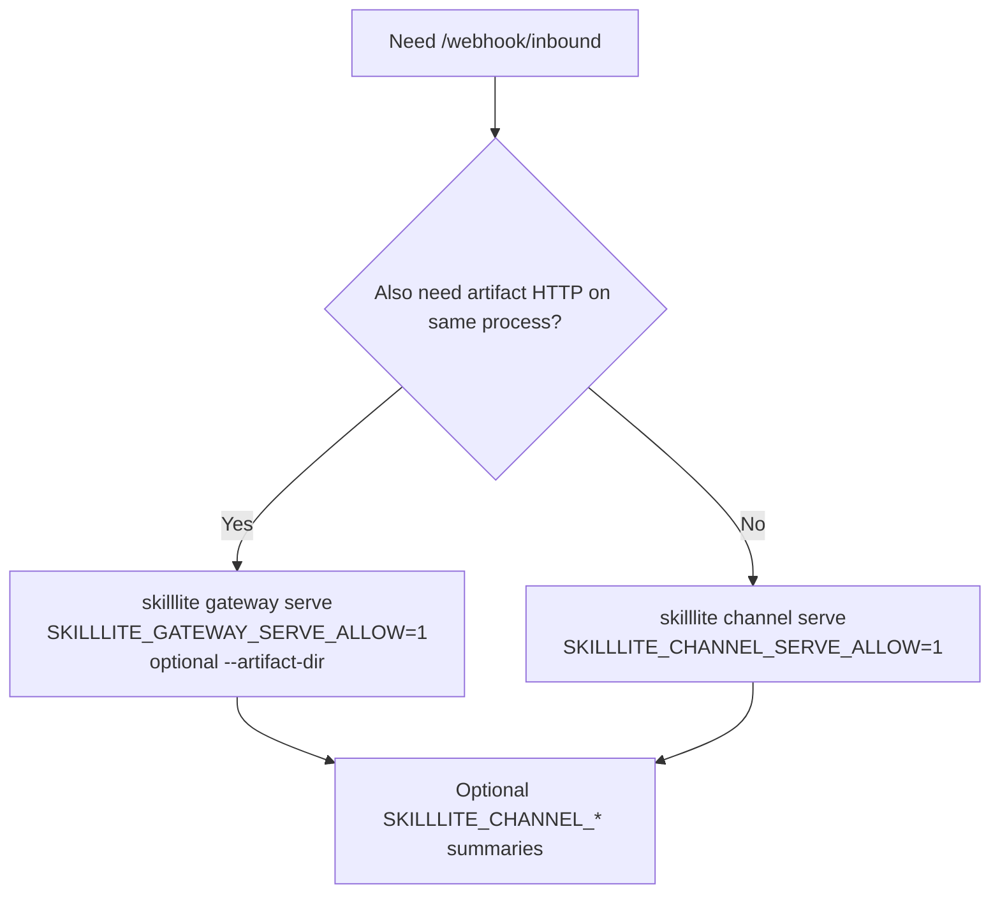
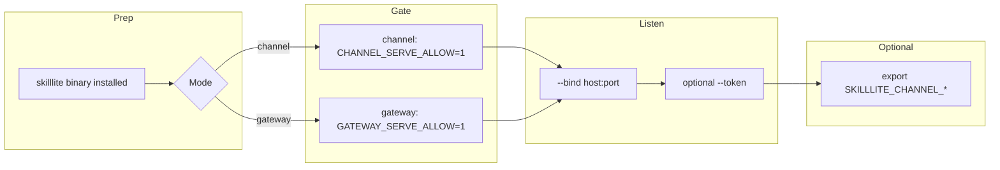
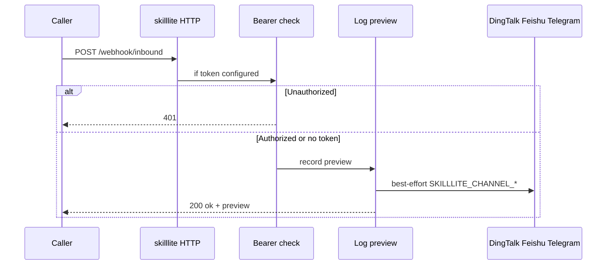

# SkillLite Channel and Gateway Configuration Guide

> **Summary**: This guide explains how SkillLite exposes inbound HTTP (`GET /health`, `POST /webhook/inbound`) via **`skilllite channel serve`** or **`skilllite gateway serve`**, and how optional **`SKILLLITE_CHANNEL_*`** environment variables send best-effort outbound summaries to DingTalk, Feishu/Lark, and Telegram after each accepted inbound request. The canonical variable list remains **[ENV_REFERENCE.md](./ENV_REFERENCE.md)**.

**Keywords**: SkillLite, Channel, Gateway, webhook, `SKILLLITE_CHANNEL_*`, DingTalk, Feishu, Lark, Telegram, `gateway serve`, `channel serve`, Bearer token

---

## Contents

1. [Concepts: inbound vs outbound summaries](#1-concepts-inbound-vs-outbound-summaries)
2. [Choose channel serve or gateway serve](#2-choose-channel-serve-or-gateway-serve)
3. [Flow overview](#3-flow-overview)
4. [Environment variables and endpoints](#4-environment-variables-and-endpoints)
5. [Worked examples](#5-worked-examples)
6. [SkillLite Assistant UI](#6-skilllite-assistant-ui)
7. [Security checklist and troubleshooting](#7-security-checklist-and-troubleshooting)
8. [Cross-links](#8-cross-links)

---

## 1. Concepts: inbound vs outbound summaries

| Direction | Meaning |
|-----------|---------|
| **Inbound** | Your process listens for HTTP and accepts `POST /webhook/inbound` with an arbitrary body. A short preview of the body is used for logging and optional IM summaries. |
| **Outbound summaries (optional)** | After a successful inbound, SkillLite may best-effort notify DingTalk / Feishu / Telegram based on `SKILLLITE_CHANNEL_*`. Failures are logged; the HTTP response is still `200 OK` when auth and handling succeed. |

`SKILLLITE_CHANNEL_*` does **not** replace inbound authentication; use `--bind`, `--token`, and fail-closed env gates as documented.

---

## 2. Choose channel serve or gateway serve



---

## 3. Flow overview

### 3.1 From install to callable service



### 3.2 Inbound request path



---

## 4. Environment variables and endpoints

### 4.1 Serve allow (fail-closed)

| Mode | Required for bind |
|------|-------------------|
| `skilllite channel serve` | `SKILLLITE_CHANNEL_SERVE_ALLOW=1` |
| `skilllite gateway serve` | `SKILLLITE_GATEWAY_SERVE_ALLOW=1` |

### 4.2 Optional outbound summaries

| Variable | Role |
|----------|------|
| `SKILLLITE_CHANNEL_DINGTALK_WEBHOOK` | DingTalk bot HTTPS webhook |
| `SKILLLITE_CHANNEL_DINGTALK_SECRET` | Optional signing secret |
| `SKILLLITE_CHANNEL_FEISHU_WEBHOOK` | Feishu custom bot webhook |
| `SKILLLITE_CHANNEL_FEISHU_SECRET` | Optional verify secret |
| `SKILLLITE_CHANNEL_TELEGRAM_BOT_TOKEN` | Telegram Bot API token |
| `SKILLLITE_CHANNEL_TELEGRAM_CHAT_ID` | Chat id (numeric, `-100…`, or `@username`); use **with** token |

### 4.3 Insecure no-auth on non-loopback (lab only)

- Channel: `SKILLLITE_CHANNEL_HTTP_ALLOW_INSECURE_NO_AUTH=1`
- Gateway: `SKILLLITE_GATEWAY_HTTP_ALLOW_INSECURE_NO_AUTH=1`

Prefer `--token` and TLS at a reverse proxy in production.

### 4.4 Endpoints

- `GET /health`
- `POST /webhook/inbound` — if `--token` is set, send `Authorization: Bearer <token>`.

---

## 5. Worked examples

Replace placeholders with your own secrets and URLs.

### Example A: Local gateway + Bearer + DingTalk summary

```bash
export SKILLLITE_CHANNEL_DINGTALK_WEBHOOK='https://oapi.dingtalk.com/robot/send?access_token=YOUR_TOKEN'

SKILLLITE_GATEWAY_SERVE_ALLOW=1 skilllite gateway serve \
  --bind 127.0.0.1:8787 \
  --token 'your-shared-secret'
```

Smoke test:

```bash
curl -sS "http://127.0.0.1:8787/health"
curl -sS -X POST "http://127.0.0.1:8787/webhook/inbound" \
  -H "Authorization: Bearer your-shared-secret" \
  -H "Content-Type: application/json" \
  -d '{"event":"deploy_ok","ref":"main"}'
```

### Example B: Channel serve only

```bash
export SKILLLITE_CHANNEL_FEISHU_WEBHOOK='https://open.feishu.cn/open-apis/bot/v2/hook/YOUR_HOOK'

SKILLLITE_CHANNEL_SERVE_ALLOW=1 skilllite channel serve \
  --bind 127.0.0.1:7800 \
  --token 'your-shared-secret'
```

### Example C: Gateway + artifact directory

```bash
SKILLLITE_GATEWAY_SERVE_ALLOW=1 skilllite gateway serve \
  --bind 127.0.0.1:8787 \
  --token 'your-shared-secret' \
  --artifact-dir './.skilllite'
```

### Example D: Telegram summary

```bash
export SKILLLITE_CHANNEL_TELEGRAM_BOT_TOKEN='123456:ABC-DEF'
export SKILLLITE_CHANNEL_TELEGRAM_CHAT_ID='-1001234567890'

SKILLLITE_GATEWAY_SERVE_ALLOW=1 skilllite gateway serve --bind 127.0.0.1:8787 --token 'your-shared-secret'
```

---

## 6. SkillLite Assistant UI

In **Settings → Gateway / inbound HTTP**, you can persist bind, optional token, optional artifact dir, and DingTalk / Feishu / Telegram fields (stored in the app WebView **localStorage**). **Start here** injects the same `SKILLLITE_CHANNEL_*` and `SKILLLITE_GATEWAY_SERVE_ALLOW=1` into the managed child as you would export in a shell. The page can also detect an **externally** running gateway on the same bind.

---

## 7. Security checklist and troubleshooting

- Use `--token` for any non-local exposure; terminate TLS at a reverse proxy.
- Avoid `*_ALLOW_INSECURE_NO_AUTH=1` outside controlled labs.
- If summaries never arrive, check process logs; outbound notify is best-effort.

| Symptom | Check |
|---------|-------|
| Process exits without listening | Missing `SKILLLITE_*_SERVE_ALLOW=1`. |
| 401 | Bearer value must match `--token`. |
| Health fails from browser | Host/port must match `bind` (for `0.0.0.0`, try `127.0.0.1` locally). |

---

## 8. Cross-links

- Variables: [./ENV_REFERENCE.md](./ENV_REFERENCE.md)
- Architecture: [./ARCHITECTURE.md](./ARCHITECTURE.md)
- Chinese version: [../zh/GUIDE_CHANNEL_GATEWAY.md](../zh/GUIDE_CHANNEL_GATEWAY.md)
