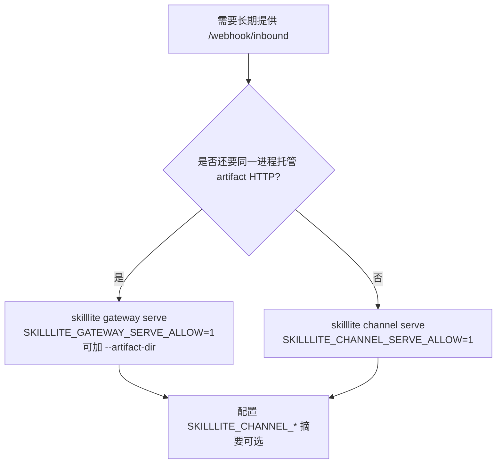
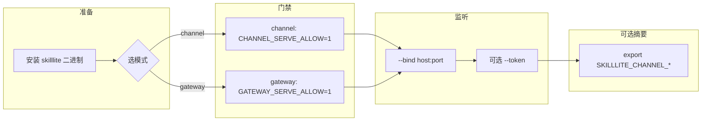
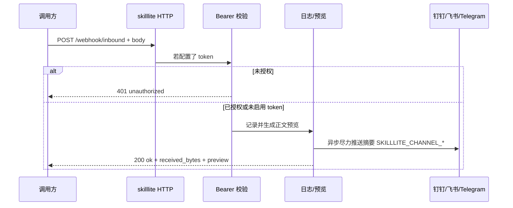

<!--
  文档类型：运维 / 集成指南（面向搜索引擎与中文技术社区转载结构）
  建议 CSDN 属性：原创 | 分类「网络与通信」或「运维」| 标签见文末「检索与标签」
-->

# SkillLite Channel 与 Gateway 配置完全指南：Webhook、环境变量与桌面助手

> **摘要**：本文说明 SkillLite 如何通过 **`skilllite channel serve`** 或 **`skilllite gateway serve`** 暴露入站 HTTP（`POST /webhook/inbound`），以及如何用环境变量 **`SKILLLITE_CHANNEL_*`** 将入站内容摘要推送到钉钉、飞书（Lark）与 Telegram；并给出 **SkillLite Assistant** 图形化配置流程、安全注意与可复制命令案例。权威变量表仍以 [环境变量参考](./ENV_REFERENCE.md) 为准。

**关键词**：SkillLite、Channel、Gateway、webhook 配置、SKILLLITE_CHANNEL、钉钉机器人、飞书机器人、Telegram Bot、gateway serve、channel serve、入站 HTTP、Bearer 鉴权

**适用读者**：需要在 CI、监控、IM 机器人或自建中间件与 SkillLite 之间打通 HTTP 的开发者与运维；希望「一个进程」同时托管 webhook 与 artifact 的集成方。

---

## 目录

1. [核心概念：入站 vs 出站摘要](#1-核心概念入站-vs-出站摘要)
2. [决策：选 channel serve 还是 gateway serve](#2-决策选-channel-serve-还是-gateway-serve)
3. [配置流程总览（流程图）](#3-配置流程总览流程图)
4. [环境变量与端点](#4-环境变量与端点)
5. [实践案例](#5-实践案例)
6. [SkillLite Assistant 图形化配置](#6-skilllite-assistant-图形化配置)
7. [安全清单与排错](#7-安全清单与排错)
8. [检索与标签（GEO / 站内检索）](#8-检索与标签geo--站内检索)

---

## 1. 核心概念：入站 vs 出站摘要

| 方向 | 含义 | 典型用途 |
|------|------|----------|
| **入站（Inbound）** | 你的进程监听 TCP，对外提供 `GET /health` 与 `POST /webhook/inbound`。请求体可为任意字节；服务会记录长度并取正文前缀做预览（用于日志与下游摘要）。 | CI、告警系统、自建网关将事件 POST 到 SkillLite。 |
| **出站摘要（可选）** | 每次**鉴权通过且已接受**的入站请求之后，根据环境变量**尽力**调用钉钉 / 飞书 / Telegram API 发送一段文本摘要；失败只打日志，**不**影响 HTTP 200 响应。 | 同一事件既进 SkillLite，又在群里留痕。 |

**说明**：`SKILLLITE_CHANNEL_*` 配置的是「摘要往哪发」，不是「谁有权连接你的 SkillLite」；后者由监听地址、`--token` 与 fail-closed 环境变量共同约束。

---

## 2. 决策：选 channel serve 还是 gateway serve



- **只要入站 webhook**：`channel serve` 足够。
- **还要 `GET/PUT .../artifacts`**：用 **`gateway serve`** 并设置 `--artifact-dir`（详见 [ENV_REFERENCE](./ENV_REFERENCE.md) 中 gateway 小节）。

---

## 3. 配置流程总览（流程图）

### 3.1 从「零」到「可调用」



### 3.2 单次入站请求在服务端的路径（逻辑流）



---

## 4. 环境变量与端点

### 4.1 启动门禁（fail-closed）

| 模式 | 必须设为 `1` 才监听 |
|------|---------------------|
| `skilllite channel serve` | `SKILLLITE_CHANNEL_SERVE_ALLOW` |
| `skilllite gateway serve` | `SKILLLITE_GATEWAY_SERVE_ALLOW` |

### 4.2 可选出站摘要

| 变量 | 说明 |
|------|------|
| `SKILLLITE_CHANNEL_DINGTALK_WEBHOOK` | 钉钉机器人 HTTPS Webhook URL |
| `SKILLLITE_CHANNEL_DINGTALK_SECRET` | 可选，钉钉加签密钥 |
| `SKILLLITE_CHANNEL_FEISHU_WEBHOOK` | 飞书自定义机器人 Webhook |
| `SKILLLITE_CHANNEL_FEISHU_SECRET` | 可选，飞书签名校验密钥 |
| `SKILLLITE_CHANNEL_TELEGRAM_BOT_TOKEN` | Telegram Bot Token |
| `SKILLLITE_CHANNEL_TELEGRAM_CHAT_ID` | 会话 id（数字、`-100…` 或 `@username`）；与 Token **成对**使用 |

### 4.3 非回环无 token（仅实验或可信反代后）

- `channel serve`：`SKILLLITE_CHANNEL_HTTP_ALLOW_INSECURE_NO_AUTH=1`
- `gateway serve`：`SKILLLITE_GATEWAY_HTTP_ALLOW_INSECURE_NO_AUTH=1`

生产环境**优先**使用 `--token` + TLS 反代，而不是依赖上述「不安全」开关。

### 4.4 HTTP 端点

- `GET /health`：健康检查。
- `POST /webhook/inbound`：入站；若启动时设置了 `--token`，请求头需：`Authorization: Bearer <token>`。

---

## 5. 实践案例

以下命令中的密钥、Token、URL 均为占位符，请替换为你自己的值。

### 案例 A：本机最小 gateway（带 Bearer + 钉钉摘要）

```bash
export SKILLLITE_CHANNEL_DINGTALK_WEBHOOK='https://oapi.dingtalk.com/robot/send?access_token=YOUR_TOKEN'
# 若机器人在钉钉侧启用了加签：
# export SKILLLITE_CHANNEL_DINGTALK_SECRET='YOUR_SIGNING_SECRET'

SKILLLITE_GATEWAY_SERVE_ALLOW=1 skilllite gateway serve \
  --bind 127.0.0.1:8787 \
  --token 'your-shared-secret'
```

验证：

```bash
curl -sS "http://127.0.0.1:8787/health"
curl -sS -X POST "http://127.0.0.1:8787/webhook/inbound" \
  -H "Authorization: Bearer your-shared-secret" \
  -H "Content-Type: application/json" \
  -d '{"event":"deploy_ok","ref":"main"}'
```

预期：HTTP 200，JSON 中含 `received_bytes` 与正文前缀 `preview`；钉钉群（若 Webhook 有效）收到一条摘要。

### 案例 B：仅 channel serve（无 artifact）

```bash
export SKILLLITE_CHANNEL_FEISHU_WEBHOOK='https://open.feishu.cn/open-apis/bot/v2/hook/YOUR_HOOK'

SKILLLITE_CHANNEL_SERVE_ALLOW=1 skilllite channel serve \
  --bind 127.0.0.1:7800 \
  --token 'your-shared-secret'
```

### 案例 C：gateway 同时托管 artifact 目录

```bash
SKILLLITE_GATEWAY_SERVE_ALLOW=1 skilllite gateway serve \
  --bind 127.0.0.1:8787 \
  --token 'your-shared-secret' \
  --artifact-dir './.skilllite'
```

入站 URL 仍为 `http://127.0.0.1:8787/webhook/inbound`；artifact 路由见 [ENV_REFERENCE](./ENV_REFERENCE.md)。

### 案例 D：Telegram 摘要（Bot + chat_id 成对出现）

```bash
export SKILLLITE_CHANNEL_TELEGRAM_BOT_TOKEN='123456:ABC-DEF'
export SKILLLITE_CHANNEL_TELEGRAM_CHAT_ID='-1001234567890'

SKILLLITE_GATEWAY_SERVE_ALLOW=1 skilllite gateway serve --bind 127.0.0.1:8787 --token 'your-shared-secret'
```

---

## 6. SkillLite Assistant 图形化配置

1. 打开 **SkillLite Assistant**，进入 **设置**。
2. 打开 **「Gateway / 入站 HTTP」**（设置项持久化在应用 WebView 的 **localStorage**，勿在公共设备保存生产密钥）。
3. 填写 **bind**、可选 **token**、可选 **artifact 目录**，以及钉钉 / 飞书 / Telegram 相关字段（与上文环境变量一一对应）。
4. 使用 **「在这里启动」**：应用会向托管子进程注入与 CLI 相同的 `SKILLLITE_CHANNEL_*` 与 `SKILLLITE_GATEWAY_SERVE_ALLOW=1`，等价于案例 A 的手动 export + `gateway serve`。
5. 页面可复制「外部终端」用的完整命令（含多行 `export`），便于迁到 **systemd**、**Docker** 或 CI 常驻。

若同一 `bind` 上已有**外部** gateway 在运行，助手会识别为**外部运行中**，避免误以为未启动。

---

## 7. 安全清单与排错

**上线前核对：**

- [ ] 生产监听是否配合 `--token`，且 Token 仅通过密钥管理分发。
- [ ] 公网是否走 HTTPS 终止在反向代理，仅内网访问 SkillLite 监听端口。
- [ ] 是否避免在非受控环境设置 `*_ALLOW_INSECURE_NO_AUTH=1`。
- [ ] 钉钉/飞书 Webhook 与 Telegram Token 是否按最小权限机器人配置。

**常见问题：**

| 现象 | 排查方向 |
|------|----------|
| 进程立即退出、未监听 | 是否忘记 `SKILLLITE_*_SERVE_ALLOW=1`。 |
| 401 unauthorized | `Authorization: Bearer` 与启动时 `--token` 是否一致（含空格与引号）。 |
| 摘要未收到 | 摘要为尽力而为；查进程日志；确认 Webhook/签名校验/chat_id。 |
| 健康检查失败 | `GET /health` 的 host/port 是否与 `bind` 一致；`0.0.0.0` 绑定时本机探测常用 `127.0.0.1`。 |

---

## 8. 检索与标签（GEO / 站内检索）

**推荐标签 / 话题**：`SkillLite` `Gateway` `Channel` `Webhook` `Inbound HTTP` `钉钉` `飞书` `Lark` `Telegram` `环境变量` `CLI` `Tauri` `本地优先`

**英文对照（便于双语检索）**：`skilllite gateway serve` · `skilllite channel serve` · `SKILLLITE_GATEWAY_SERVE_ALLOW` · `SKILLLITE_CHANNEL_SERVE_ALLOW` · `POST /webhook/inbound`

**规范引用**：

- 环境变量全文：[./ENV_REFERENCE.md](./ENV_REFERENCE.md)
- 架构中与 gateway 的关系：[./ARCHITECTURE.md](./ARCHITECTURE.md)

**镜像文档（英文）**：[../en/GUIDE_CHANNEL_GATEWAY.md](../en/GUIDE_CHANNEL_GATEWAY.md)

---

*文档版本与仓库行为对齐；若 CLI 或变量语义变更，请以 `ENV_REFERENCE` 与源码为准。*
