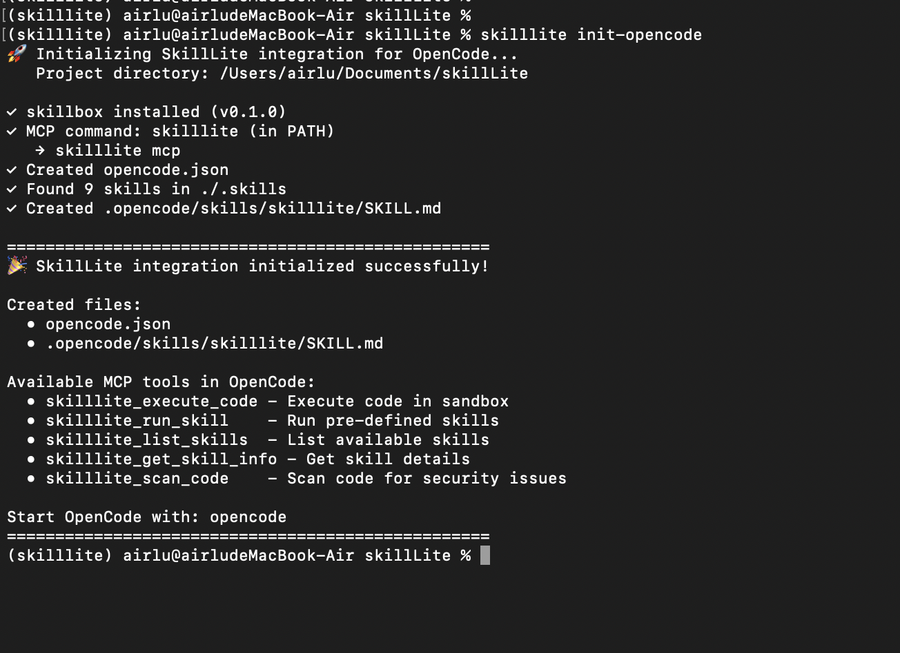
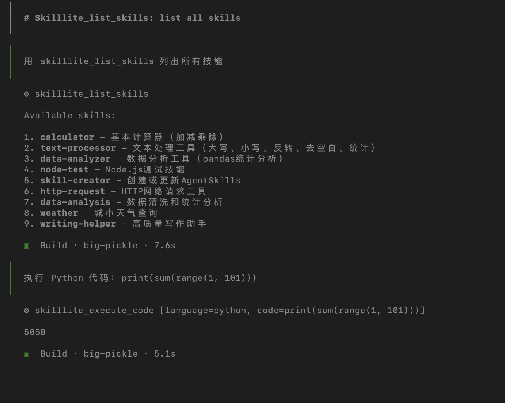

# 07. OpenCode Integration

Integrate SkillLite as an MCP tool server for [OpenCode](https://github.com/opencode-ai/opencode) - the open source AI coding agent.

## Overview

OpenCode supports MCP (Model Context Protocol) for extending its capabilities. By integrating SkillLite, OpenCode gains:

- **Secure Code Execution**: Run Python/JavaScript/Bash in a sandboxed environment (macOS Seatbelt / Linux Namespace)
- **Security Scanning**: Scan code for vulnerabilities before execution
- **Pre-defined Skills**: Execute your custom skills through OpenCode
- **User Confirmation Flow**: Dangerous code requires explicit user approval

## Quick Start (One Command!)

```bash
# 1. Install SkillLite with MCP support
pip install skilllite[mcp]

# 2. One-command setup (auto-detects best configuration)
skilllite init-opencode

# 3. Start OpenCode
opencode
```



That's it! The `init-opencode` command automatically:
- Installs the skillbox sandbox binary
- Detects the best way to start the MCP server
- Creates `opencode.json` with optimal configuration
- Generates `.opencode/skills/skilllite/SKILL.md` with usage instructions
- Discovers your pre-defined skills in `.skills/` directory

## Manual Configuration (Optional)

If you prefer manual setup, create `opencode.json` in your project root:

```json
{
  "$schema": "https://opencode.ai/config.json",
  "mcp": {
    "skilllite": {
      "type": "local",
      "command": ["skilllite", "mcp"],
      "environment": {
        "SKILLBOX_SANDBOX_LEVEL": "3",
        "SKILLLITE_SKILLS_DIR": "./.skills"
      },
      "enabled": true
    }
  }
}
```

## Available MCP Tools

Once configured, OpenCode will have access to these tools:

### Skills Management Tools

| Tool | Description |
|------|-------------|
| `skilllite_list_skills` | List all available pre-defined skills |
| `skilllite_get_skill_info` | Get detailed information about a skill |
| `skilllite_run_skill` | Execute a pre-defined skill |

### Code Execution Tools

| Tool | Description |
|------|-------------|
| `skilllite_scan_code` | Scan code for security issues (without executing) |
| `skilllite_execute_code` | Execute code in a secure sandbox |

### Tool Parameters

#### `skilllite_execute_code`
```
Arguments:
  - language: "python" | "javascript" | "bash"
  - code: The code to execute
  - confirmed: boolean (required when high-severity issues found)
  - scan_id: string (from previous scan, required with confirmed=true)
  - sandbox_level: 1 | 2 | 3 (optional, default: 3)
```

#### `skilllite_run_skill`
```
Arguments:
  - skill_name: Name of the skill to execute
  - input: JSON object with skill input parameters
```

## Sandbox Levels

| Level | Description | Use Case |
|-------|-------------|----------|
| 1 | No sandbox | Trusted code, full system access |
| 2 | Sandbox only | Isolated execution, no security scan |
| 3 | Sandbox + Scan | Maximum security (default) |

## Security Confirmation Flow

When dangerous code is detected, SkillLite follows a secure confirmation flow:

```
1. User requests code execution
2. SkillLite scans code for security issues
3. If high-severity issues found:
   → Returns requires_confirmation=true with scan_id
   → OpenCode shows security report to user
4. User reviews and confirms
5. OpenCode calls execute_code with confirmed=true and scan_id
6. Code executes in sandbox
```

Example interaction:
```
User: Execute this code: import os; os.system("ls -la /")

OpenCode: ⚠️ Security issues detected:
  - Dangerous module import: os
  - Process execution: os.system()

  Do you want to proceed? [y/N]

User: y

OpenCode: Code executed successfully in sandbox.
```

## Usage Examples

After setup, start OpenCode and try these commands:



### List Available Skills
```
用 skilllite_list_skills 列出所有技能
```

### Execute Safe Code
```
用 skilllite_execute_code 执行 Python 代码：print(sum(range(1, 101)))
```

### Run a Pre-defined Skill
```
用 skilllite_run_skill 执行 calculator 技能，计算 100 + 200
```

### Test Security Scanning
```
用 skilllite_scan_code 扫描这段代码：import os; os.system("rm -rf /")
```

## When to Use SkillLite vs bash

| Scenario | Use bash | Use SkillLite |
|----------|----------|---------------|
| Git operations | ✅ | |
| Read project files | ✅ | |
| Execute user-provided code | | ✅ |
| Network requests / API calls | | ✅ |
| Data analysis | | ✅ |
| Run untrusted scripts | | ✅ |
| Execute potentially dangerous commands | | ✅ |

## Verification

Test that the integration works:

```bash
# Start OpenCode
opencode

# In OpenCode, ask:
> 你有哪些 skilllite 工具？
```

You should see 5 tools: `skilllite_list_skills`, `skilllite_get_skill_info`, `skilllite_run_skill`, `skilllite_scan_code`, `skilllite_execute_code`.

## Troubleshooting

### MCP Server Not Starting

```bash
# Test MCP server manually
skilllite mcp

# Check skillbox is installed
skilllite status
```

### Re-initialize Configuration

```bash
# Force regenerate all configuration files
skilllite init-opencode --force
```

### Check Skills Directory

```bash
# Specify a different skills directory
skilllite init-opencode --skills-dir ./my-skills
```

## CLI Reference

```bash
skilllite init-opencode [OPTIONS]

Options:
  -p, --project-dir DIR   Project directory (default: current directory)
  -s, --skills-dir DIR    Skills directory path (default: ./.skills)
  -f, --force             Force overwrite existing opencode.json
  -h, --help              Show help message
```

## Next Steps

- [06. MCP Server](../06_mcp_server/README.md) - More MCP details
- [Creating Skills](../02_skill_management/README.md) - Create your own skills
- [OpenCode Documentation](https://opencode.ai/docs)
- [MCP Protocol Specification](https://modelcontextprotocol.io/)

